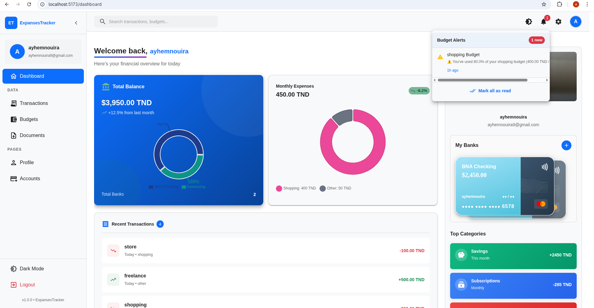
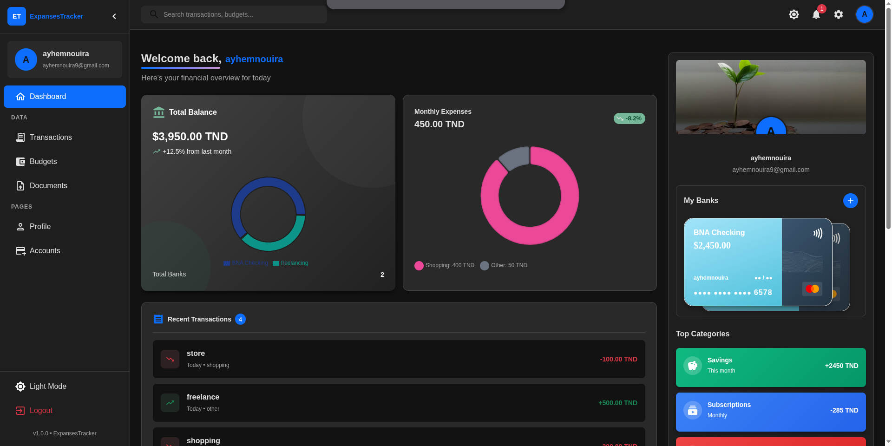
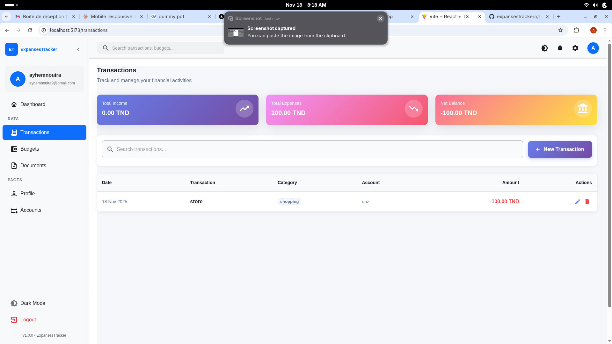
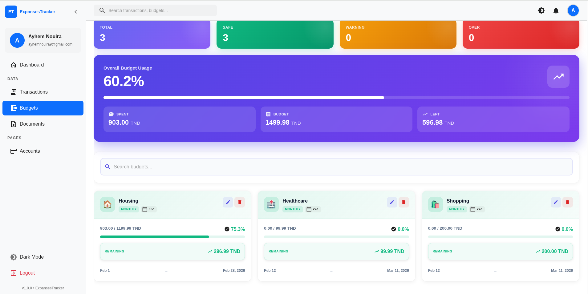
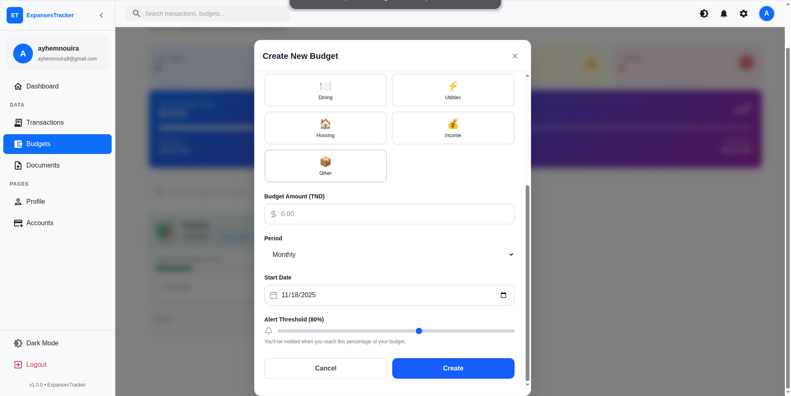
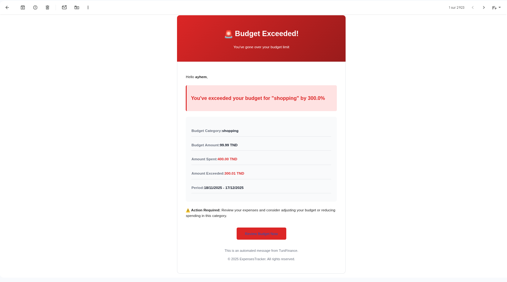
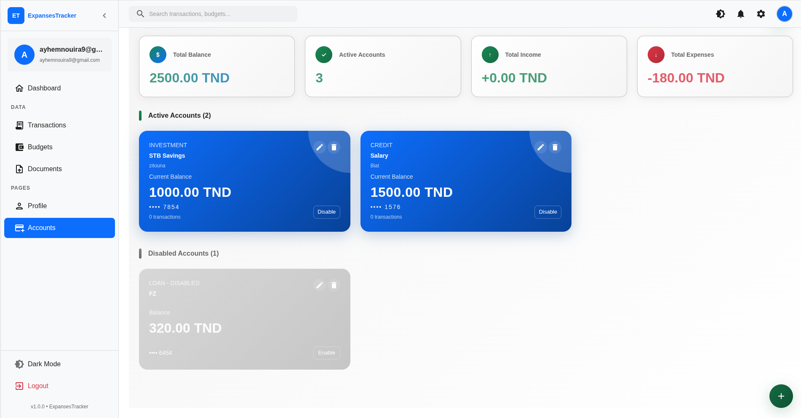

# 💰 ExpensesTracker - Smart Personal Finance Manager

A modern, full-stack financial management application built with **Spring Boot** and **React** that helps users track expenses, manage budgets, and gain insights into their spending habits with intelligent alerts and beautiful visualizations.


**[Live Demo](https://expansestrackera.vercel.app/)**

## ✨ Key Features

### 🔐 Authentication & Security
- **JWT-based authentication** with access & refresh tokens
- Secure password encryption with BCrypt
- Session management with token refresh mechanism
- Protected API endpoints with Spring Security

### 📊 Dashboard & Analytics
- **Real-time financial overview** with interactive charts
- Monthly expense tracking with trend analysis
- Account balance visualization (Recharts)
- Category-wise spending breakdown
- Transaction history timeline

### 💳 Transaction Management
- Add, edit, and delete transactions (Income/Expense)
- Multiple account support (Checking, Savings, Credit)
- Category classification (Food, Transport, Shopping, etc.)
- Receipt upload and document attachment (PDF, JPG, PNG)
- Advanced search and filtering by category, date, and account

### 🎯 Budget Management
- **Smart budget tracking** with 12+ categories
- Real-time spending progress indicators
- **Intelligent email alerts** at 80% and 100% budget thresholds
- Monthly budget periods with automatic tracking
- Visual budget vs. actual spending comparison
- Budget summary with total/remaining amounts

### 🏦 Account Management
- Multiple account support (Bank accounts, Credit cards, Cash)
- Track balances across all accounts
- Enable/Disable accounts
- Account type categorization (Depository, Credit, Investment)
- Shareable account links for collaboration
- Account summary with total balances by type

### 📁 Document Management
- Upload receipts and financial documents
- Link documents to specific transactions
- Support for PDF, JPG, PNG (Max 5MB)
- Document preview and download
- Filter documents by type (Receipt, Invoice, Bill, etc.)

### 📧 Email Notifications
- **Automated budget alerts** sent via email
- 80% threshold warning emails
- 100% budget exceeded notifications
- Professional HTML email templates
- Configurable email settings

### 🌓 User Experience
- **Dark/Light mode** toggle
- Fully responsive design (Mobile, Tablet, Desktop)
- Smooth animations and transitions
- Clean, modern Material-UI interface
- Real-time notifications and alerts

## 🛠️ Tech Stack

### Backend
- **Spring Boot 3.x** - Application framework
- **Spring Security** - Authentication & Authorization
- **JWT** - Token-based authentication
- **MySQL** - Relational database
- **Hibernate/JPA** - ORM
- **Maven** - Dependency management
- **Spring Mail** - Email notifications
- **Swagger/OpenAPI** - API documentation
- **RESTful API** - Clean API design

### Frontend
- **React 18** with TypeScript
- **Material-UI (MUI)** - UI component library
- **Recharts** - Data visualization
- **Axios** - HTTP client
- **React Router** - Navigation
- **Vite** - Build tool

### Deployment & DevOps
- **Frontend:** Vercel
- **Backend:** Railway
- **Database:** MySQL (Railway)
- **Version Control:** Git/GitHub

## 📸 Screenshots

### Dashboard



### Transactions



### Budget Management




### Account Management


## 🚀 Getting Started

### Prerequisites
- **Java 17+**
- **Node.js 18+**
- **MySQL 8.0+**
- **Maven 3.8+**

### Backend Setup

1. **Clone the repository**
```bash
git clone https://github.com/ayhemnouira/ExpensesTracker.git
cd ExpensesTracker/backend
```

2. **Configure database**
Create `application.properties`:
```properties
# Database
spring.datasource.url=jdbc:mysql://localhost:3306/expense-tracker
spring.datasource.username=your_username
spring.datasource.password=your_password

# JWT
jwt.secret=your-secret-key-here-minimum-32-characters
jwt.access-token-validity=86400000
jwt.refresh-token-validity=604800000

# Email (Optional - for budget alerts)
spring.mail.host=smtp.gmail.com
spring.mail.port=587
spring.mail.username=your-email@gmail.com
spring.mail.password=your-app-password
app.mail.from=noreply@expensestracker.tn
app.mail.enabled=true

# CORS
cors.allowed.origins=http://localhost:3000,http://localhost:5173

# File Upload
file.upload-dir=uploads
spring.servlet.multipart.max-file-size=5MB
```

3. **Run the application**
```bash
./mvnw clean install
./mvnw spring-boot:run
```

Backend runs on: `http://localhost:8080`

### Frontend Setup

1. **Navigate to frontend**
```bash
cd ../frontend
```

2. **Install dependencies**
```bash
npm install
```

3. **Configure environment**
Create `.env`:
```env
VITE_API_URL=http://localhost:8080/api
```

4. **Run development server**
```bash
npm run dev
```

Frontend runs on: `http://localhost:5173`

## 📋 API Endpoints

### Authentication
- `POST /api/auth/register` - Register new user
- `POST /api/auth/login` - User login
- `POST /api/auth/refresh` - Refresh access token

### Transactions
- `GET /api/transactions` - Get all transactions
- `GET /api/transactions/{id}` - Get transaction by ID
- `GET /api/transactions/month?year={year}&month={month}` - Get transactions by month
- `GET /api/transactions/category/{category}` - Get transactions by category
- `GET /api/transactions/summary` - Get income/expense summary
- `POST /api/transactions` - Create transaction
- `PUT /api/transactions/{id}` - Update transaction
- `DELETE /api/transactions/{id}` - Delete transaction

### Budgets
- `GET /api/budgets` - Get all budgets
- `GET /api/budgets?activeOnly=true` - Get active budgets only
- `GET /api/budgets/{id}` - Get specific budget by ID
- `GET /api/budgets/summary` - Get budget summary
- `POST /api/budgets` - Create budget
- `PUT /api/budgets/{id}` - Update budget
- `DELETE /api/budgets/{id}` - Delete budget (soft delete)

### Accounts
- `GET /api/accounts` - Get all accounts
- `GET /api/accounts?enabledOnly=true` - Get enabled accounts only
- `GET /api/accounts/{id}` - Get account by ID
- `GET /api/accounts/summary` - Get account summary
- `GET /api/accounts/type/{type}` - Get accounts by type
- `GET /api/accounts/share/{shareableId}` - Get shareable account
- `POST /api/accounts` - Create account
- `PUT /api/accounts/{id}` - Update account
- `DELETE /api/accounts/{id}` - Delete account

### Documents
- `POST /api/documents` - Upload document (multipart/form-data)
  - **Required fields:** `file` (MultipartFile), `documentType` (DocumentType enum)
  - **Optional fields:** `description` (String), `transactionId` (Long)
- `GET /api/documents` - Get all user documents
- `GET /api/documents?type={type}` - Get documents by type
- `GET /api/documents/{id}` - Get document details
- `GET /api/documents/{id}/download` - Download document
- `GET /api/documents/transaction/{transactionId}` - Get transaction documents
- `DELETE /api/documents/{id}` - Delete document

### Budget Alerts
- `GET /api/alerts` - Get unread alerts
- `GET /api/alerts/all?limit={limit}` - Get all alerts (paginated, default limit=10)
- `GET /api/alerts/count` - Get unread alert count
- `PUT /api/alerts/{id}/read` - Mark alert as read
- `PUT /api/alerts/read-all` - Mark all alerts as read

## 🎯 Key Features Explained

### Smart Budget Alerts
The system monitors your spending in real-time and sends email notifications:
- **⚠️ 80% Alert**: Warning email when you reach 80% of your budget
- **🚨 100% Alert**: Critical email alert when budget is exceeded
- Alerts are stored in the database and displayed in the UI
- Professional HTML email templates with category-specific styling

### JWT Authentication Flow
```
1. User registers/logs in → Server validates credentials
2. Server generates JWT access token (24h) + refresh token (7d)
3. Client stores tokens securely (localStorage/cookies)
4. Protected requests include access token in Authorization header
5. When token expires → Use refresh token to get new access token
6. Refresh token rotation for enhanced security
```

### Multi-Account System
Track finances across multiple accounts:
- **Depository**: Bank checking/savings accounts
- **Credit**: Credit cards and lines of credit
- **Investment**: Investment accounts and portfolios
- **Cash**: Physical cash wallets
- Each account has independent balance tracking
- Shareable account links for family/team collaboration

### Document Management
Secure file upload and storage:
- Files stored in local `uploads/` directory
- Maximum file size: 5MB
- Supported formats: PDF, JPG, PNG
- Documents linked to transactions for easy reference
- Download functionality with proper MIME type handling

## 📦 Project Structure
```
ExpensesTracker/
├── backend/
│   ├── src/main/java/com/example/backend/
│   │   ├── config/          # Security, JWT, CORS, Swagger config
│   │   ├── controller/      # REST controllers (Auth, Transaction, Budget, etc.)
│   │   ├── dto/             # Data Transfer Objects
│   │   ├── entity/          # JPA Entity models
│   │   ├── enums/           # Enums (TransactionType, DocumentType, etc.)
│   │   ├── repo/            # JPA repositories
│   │   ├── service/         # Business logic services
│   │   ├── security/        # JWT utilities and filters
│   │   └── Response/        # API response wrappers
│   ├── uploads/             # File upload directory
│   └── pom.xml
│
├── frontend/
│   ├── src/
│   │   ├── components/      # Reusable components
│   │   ├── pages/           # Page components
│   │   ├── api/             # API services
│   │   ├── context/         # React context (Auth, Theme)
│   │   └── types/           # TypeScript types
│   └── package.json
│
└── README.md
```

## 🔒 Security Features

- **Password Hashing**: BCrypt with salt rounds
- **JWT Authentication**: Short-lived access tokens + refresh tokens
- **CORS Configuration**: Whitelist trusted origins
- **SQL Injection Prevention**: JPA parameterized queries
- **XSS Protection**: Input validation and sanitization
- **Secure File Upload**: File type and size validation
- **Role-Based Access Control**: User role authorization
- **Secure HTTP Headers**: Configured via Spring Security

## 🌐 Environment Variables

### Backend (.env or application.properties)
```properties
DATABASE_URL=jdbc:mysql://localhost:3306/expense-tracker
DATABASE_USER=your_username
DATABASE_PASSWORD=your_password
JWT_SECRET=your-secret-key-minimum-32-characters
CORS_ORIGINS=http://localhost:3000,http://localhost:5173
MAIL_USERNAME=your-email@gmail.com
MAIL_PASSWORD=your-app-password
MAIL_FROM=noreply@expensestracker.tn
PORT=8080
```

### Frontend (.env)
```env
VITE_API_URL=http://localhost:8080/api
```

## 📈 Future Enhancements

- [x] JWT authentication with refresh tokens
- [x] Budget alerts with email notifications
- [x] Multi-account support
- [x] Document/receipt upload
- [ ] AI-powered expense predictions
- [ ] OCR for receipt scanning (automated data extraction)
- [ ] Export reports (PDF/CSV)
- [ ] Multi-currency support
- [ ] Recurring transactions
- [ ] Financial goal tracking
- [ ] Bank account integration (Plaid API)
- [ ] Mobile app (React Native)

## 🐛 Known Issues & Solutions

### Email Not Sending?
1. Enable "Less Secure Apps" or use App Password for Gmail
2. Check firewall settings for port 587
3. Verify email credentials in `application.properties`

### Database Connection Failed?
1. Ensure MySQL is running: `sudo service mysql start`
2. Create database: `CREATE DATABASE expense_tracker;`
3. Verify username/password in configuration

### File Upload Errors?
1. Create `uploads/` directory in backend root
2. Check file size (max 5MB)
3. Verify file format (PDF, JPG, PNG only)

## 👨‍💻 Author

**Ayhem Nouira**
- Portfolio: [https://portfolio-roan-psi-26.vercel.app/](https://portfolio-roan-psi-26.vercel.app/)
- LinkedIn: [https://www.linkedin.com/in/ayhemnouira/](https://www.linkedin.com/in/ayhemnouira/)
- GitHub: [https://github.com/ayhemnouira](https://github.com/ayhemnouira)

## 📄 License

This project is open source and available under the [MIT License](LICENSE).

## 🙏 Acknowledgments

- Material-UI for the beautiful component library
- Recharts for data visualization
- Spring Boot community for excellent documentation
- JWT.io for authentication resources
- All open-source contributors

---

⭐ **Star this repository if you found it helpful!**

📫 **Questions?** Feel free to reach out or open an issue!

---

## 🔧 Development Notes

### Running Tests
```bash
# Backend tests
cd backend
./mvnw test

# Frontend tests
cd frontend
npm test
```

### API Documentation
Access Swagger UI at: `http://localhost:8080/swagger-ui.html`

### Database Schema
The application uses Hibernate to auto-generate schema. Set `spring.jpa.hibernate.ddl-auto=update` for automatic migrations.

### Deployment Checklist
- [ ] Set `ddl-auto=validate` in production
- [ ] Use strong JWT secret (32+ characters)
- [ ] Configure production CORS origins
- [ ] Enable HTTPS
- [ ] Set up database backups
- [ ] Configure email service
- [ ] Set file upload size limits
- [ ] Enable rate limiting
- [ ] Set up monitoring/logging
